# Feedback Control Design of 747 about Linearized Longitudinal Dynamics

<!-- ## Question 1 - True or False:

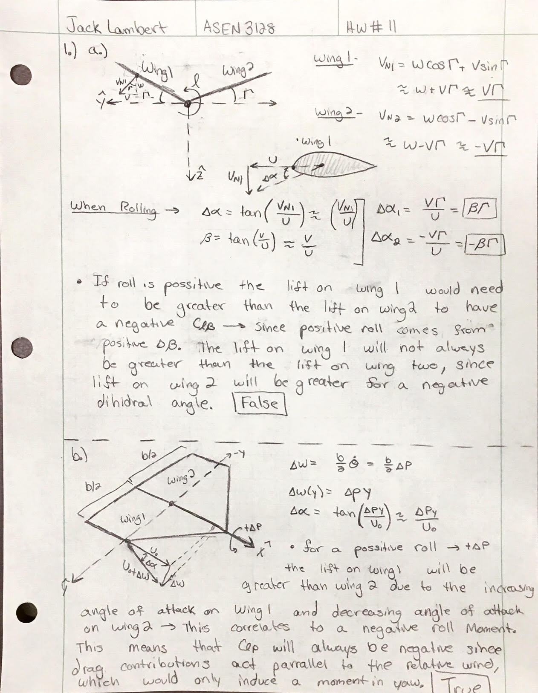 

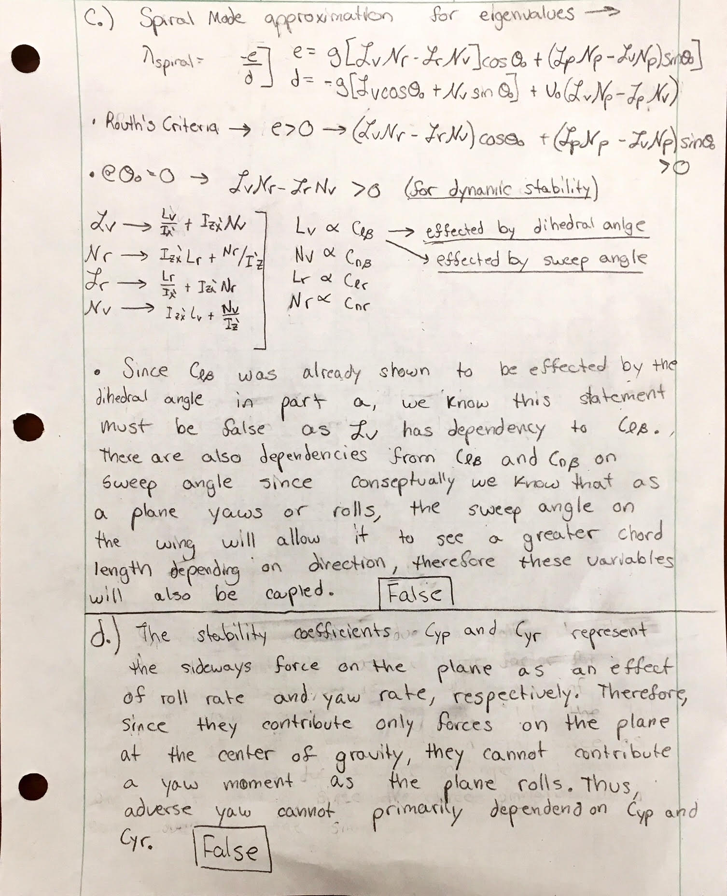 

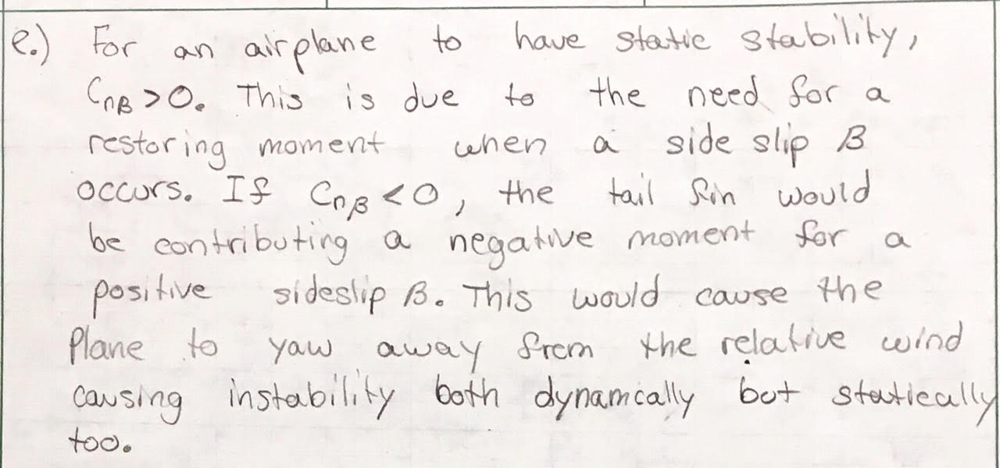  -->

## Roll and Spiral Mode Approximations:

When approximating the roll and spiral modes using the simplifying assumptions the following plot was obtained:  

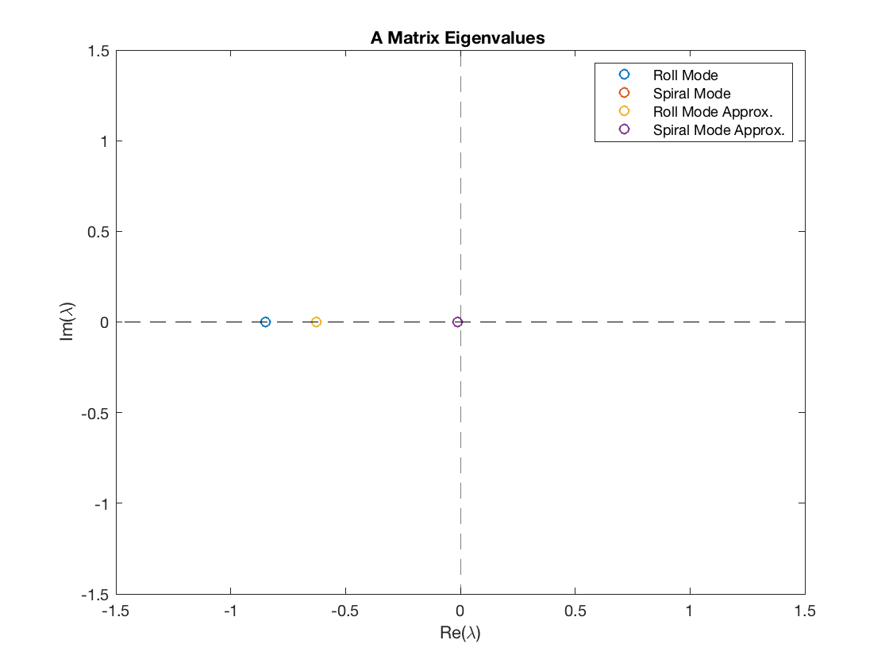 

As can be seen from the generated plot, the accuracy of the spiral mode approximation was near perfect. The assumption that we can ignore the higher order terms in the characteristic equation due to the spiral mode being two orders of magnitude smaller, proved to be a good assumption as the full A matrix eigenvalue for the spiral approximation was $\lambda_{full} = -0.0108$ and the approximation was $\lambda_{Approx} = -0.0106$, giving a relative error was only 1.29 \%. The roll mode approximation was also surprisingly close considering the approximation is one entry of the A matrix as the results show that the full A matrix roll eigenvalue was $\lambda_{full} = -0.8474$ and the approximation gave $\lambda_{Approx} = -0.6275$ giving only a 25.96 \% relative error. While a decent approximation, it is clear that the roll approximation is less accurate than the spiral approximation.  

## Question 3:

### **Part a.)**
Using the flight conditions for problem 1 of assignment 10 in conjunction with the non-dimensional control coefficients in Table 7.3, the following B matrix was computed for the linearized dynamics model:  

$$
B =
\begin{vmatrix}
0 & 1.6503  \\
-0.1376 & -0.0455 \\
-0.0034 & -0.4616\\
0 & 0 \\
\end{vmatrix}
$$
 

## **Part b.)**
Using the same flight conditions and applying the the additional output state variables, $\Delta\psi$ and $\Delta y^E$, to the 4X1 state variable matrix, $ y_{lat}$, so that the new augmented state matrix is - $y_{aug} = [y_{lat}, \Delta\psi, \Delta y^E]' $, the following augmented A and B matrices were computed:

$$
A_{aug} =
\begin{vmatrix}
-0.0800 & 0 & -157.9 & 9.810 & 0 & 0  \\
-0.0176 & -0.6275 & 0.5674 & 0 & 0 & 0 \\
0.0042 & -0.0406 & -0.1791 & 0 & 0 & 0 \\
0 & 0 & 1.000 & 0 & 0 & 0  \\
1.000 & 0 & 0 & 0 & 157.9 & 0 \,\ \\
\end{vmatrix}
$$
 

$$
B_{aug} =
\begin{vmatrix}
0 & 1.6503  \\
-0.1376 & -0.0455 \\
-0.0034 & -0.4616\\
0 & 0 \\
0 & 0 \\
0 & 0 \\
\end{vmatrix}
$$
 

## Question 4 - Eigenvalues:

In the following plots the dutch roll mode can be characterized by the mode that has both real and imaginary parts for its open loop gain, which is labeled in the plots by a red circle. A more stable dutch roll mode would occur if the real parts get more negative in a way such that they grow more quickly than the imaginary part. This occurs due to the envelope of the oscillation decreasing more quickly than the oscillatory motion increases. The Roll mode and spiral mode both only have real parts. The Roll mode can be characterized by having larger negative real parts than the spiral mode. Stability for these modes occur when the real parts become more negative. The  roll mode is naturally more stable as it has larger negative open loop real parts. This mode is not a mode that needs to be changed much for system stability since it is naturally stable. The opposite can be said about the spiral mode as it has very small negative real parts about its open loop configuration.   

### **Part a.) - $\Delta\delta_a = K\Delta\phi$, $\Delta\delta_r = 0$, $K = 0:0.01:10$**
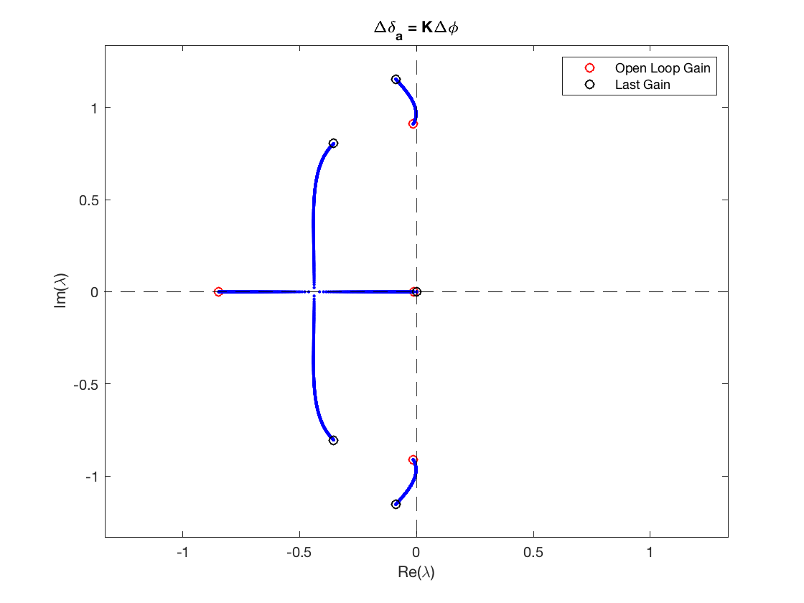 

As can be seen by the plot, the real parts of the ditch roll mode are increasing at a rate that is slower than the imaginary parts. This would have the effect of the oscillation growing more quickly than the envelope that is driving the oscillations, which would result in more likely a less stable system. The Spiral mode is seen to increase to a point where it then becomes a conjugate pair. This would increase the stability about this mode as the real parts are getting more negative. The roll mode had the inverse effect that the spiral mode did. While this would make the spiral mode less stable, the spiral mode is already sufficiently stable and would most likely not effect the mode much. Since the control matrix would be changing the entire $\phi$ column, no stability derivatives would be directly effected in the A matrix.  

### **Part b.) - $\Delta\delta_a = K\Delta p$, $\Delta\delta_r = 0$, $-K = 0:0.01:10$**

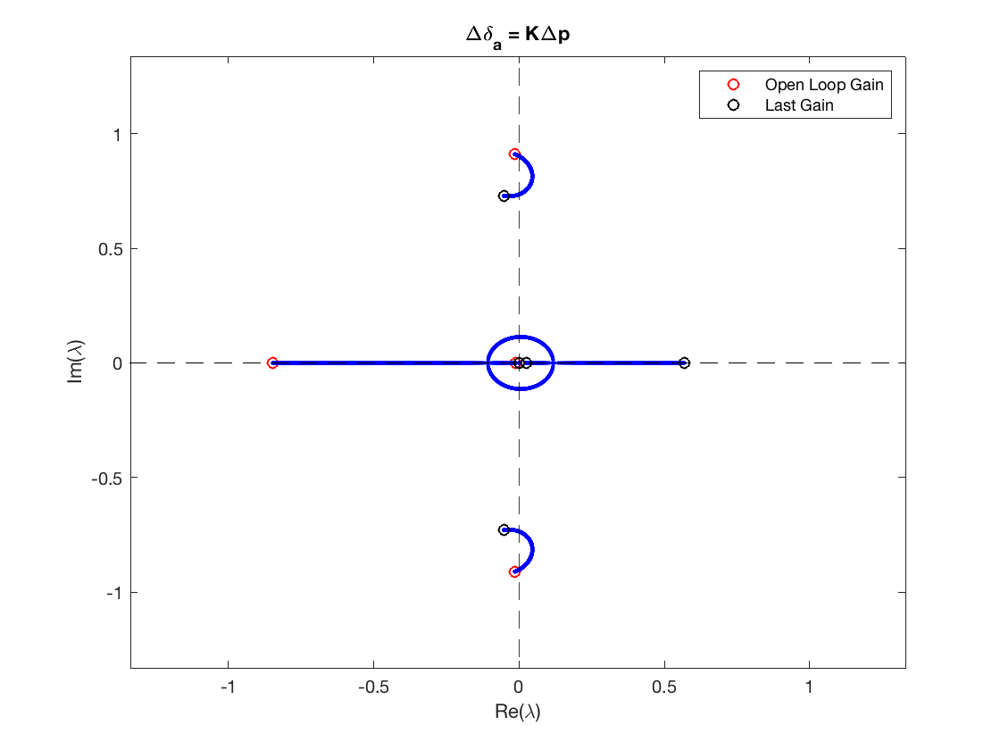 

When analyzing the plots, the dutch roll mode is seen to initially get less stable as the real parts became less negative, however, at the end of the K matrix, the gains became more and more stable as the real parts became more negative and and the imaginary parts became smaller. This would decrease both the oscillations and the drive the envelope faster. The roll mode is seen to increase its imaginary parts and become less stable as the spiral mode does the same. Both of these modes are driven to be less stable. Since the control matrix would be changing the entire $p$ column, the stability derivatives that would be effected would be the $Y_p$, $L_p$, and $N_p$.  

### **Part c.) - $\Delta\delta_a = K\Delta r$, $\Delta\delta_r = 0$, $-K = 0:0.01:10$**

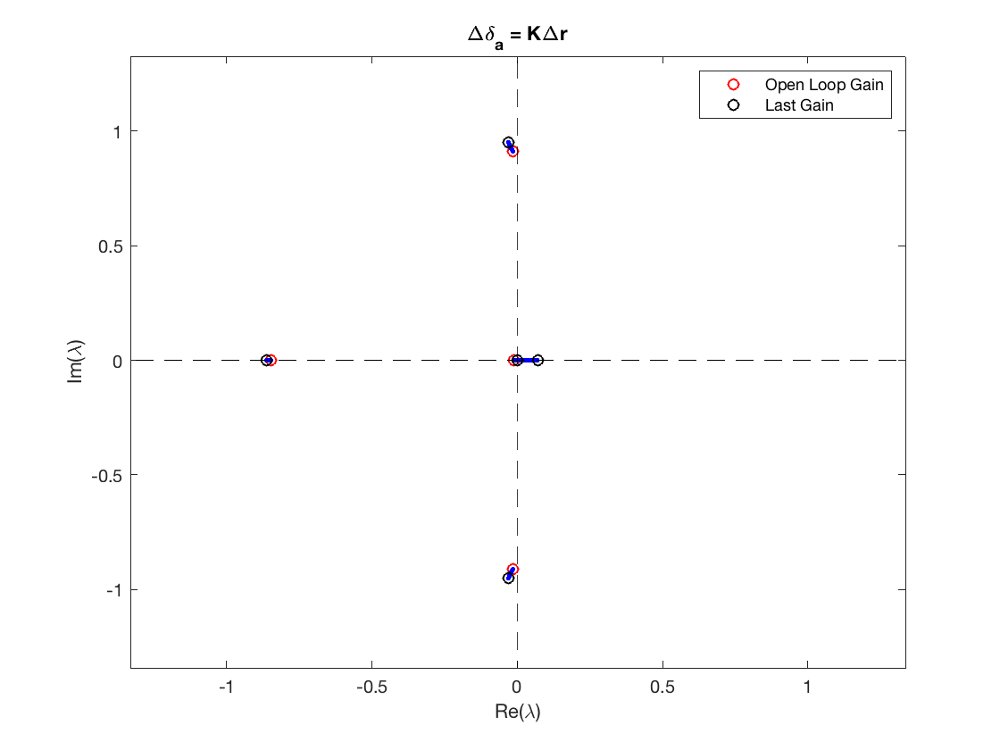 

As illustrated in the plots, the dutch roll mode is not effected much at all. While the real parts incrementally increase, the imaginary parts due as well, which shows that the system mostly likely will remain just about as stable about this mode. The roll mode is seen to barely change as well. The roll mode increases slightly, which would inherently - slightly increase it stability. The spiral mode is seen to get more positive real parts, which would make the mode less stable. Since the control matrix would be changing the entire $r$ column, the stability derivatives that would be effected would be the $Y_r$, $L_r$, and $N_r$.  

### **Part d.) - $\Delta\delta_a = K\Delta\psi$, $\Delta\delta_r = 0$, $-K = 0:0.0001:0.1$**

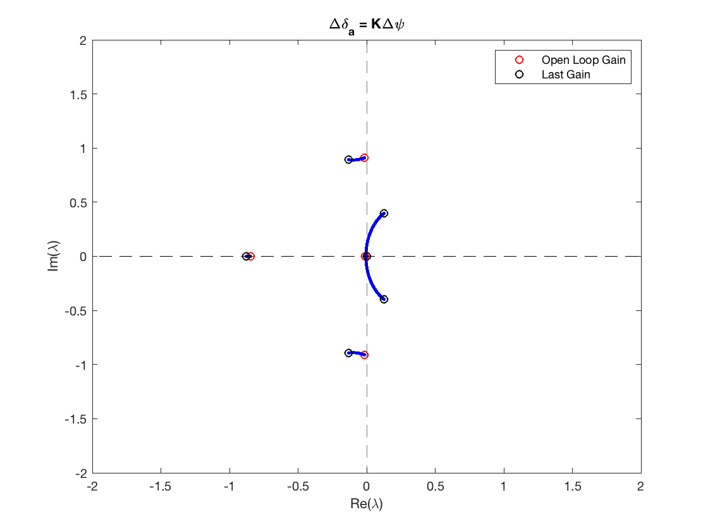 

The dutch roll mode, as depicted in these plots, is seen to have increasingly negative real parts, while simultaneously also having decreasing imaginary parts. This would make the mode more stable as the system's envelope would be driven to trim much quicker, with less osculations. The roll mode is seen to get slightly more stable as its real parts get more negative. The spiral mode is seen to acquire imaginary parts as it also gets larger real parts. This would make the spiral mode very unstable. Since the control matrix would be changing the entire $\psi$ column, no stability derivatives would be directly effected in the A matrix.  

## **Part e.) - $\Delta\delta_a = 0$, $\Delta\delta_r = K\Delta v$, $K = 0:0.01:10$**

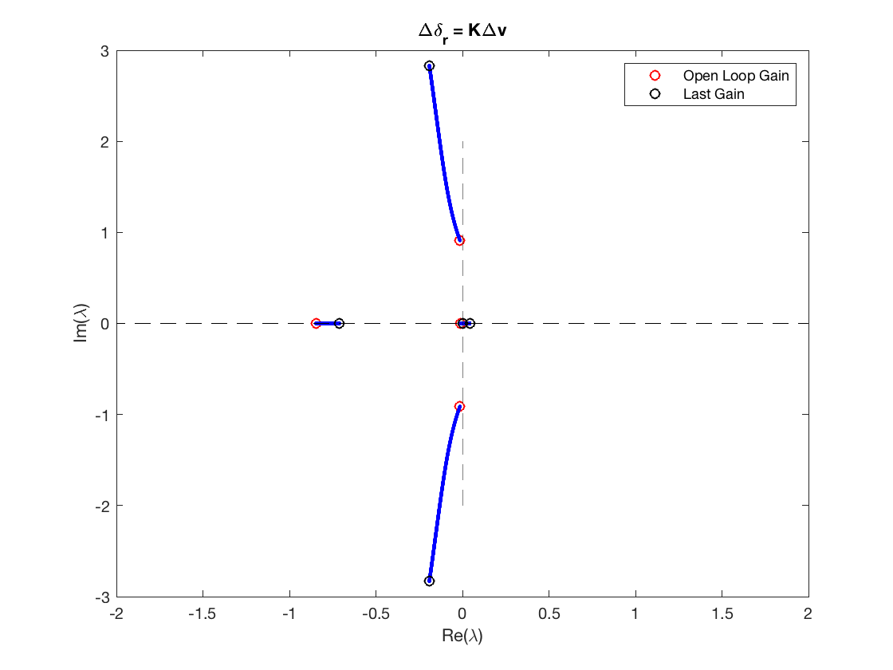 

As can be seen by the plots, all three of the modes become less stable. The dutch roll mode has imaginary parts that are increasing much faster than the real parts are decreasing, therefore would be less stable. The roll mode and spiral mode had real parts that increased, making them increasingly less stable. Since the control matrix would be changing the entire $v$ column, the stability derivatives that would be effected would be the $Y_v$, $L_v$, and $N_v$.  

### **Part f.) - $\Delta\delta_a = 0$, $\Delta\delta_r = K\Delta p$, $-K = 0:0.01:2$**

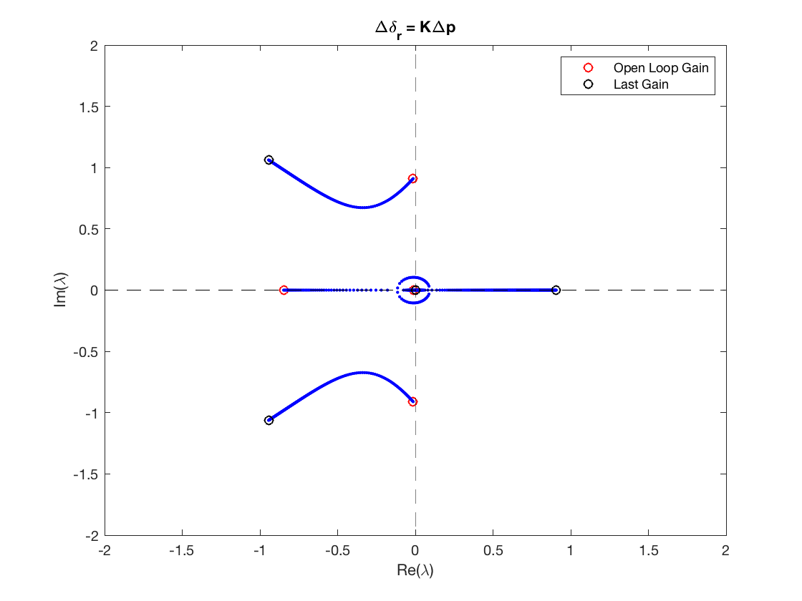 

The dutch roll mode is seen to have increasing negative real parts for the whole range of the K matrix. While the imaginary parts increase for some of the K matrix, it increases much slower than the real parts decrease, therefore the system is becoming much more stable. The roll mode and spiral are seen to increase their real parts as they become less stable. Since the control matrix would be changing the entire $p$ column, the stability derivatives that would be effected would be the $Y_p$, $L_p$, and $N_p$.  

### **Part g.) - $\Delta\delta_a = 0$, $\Delta\delta_r = K\Delta r$, $|K| = 0:0.01:5$**

| 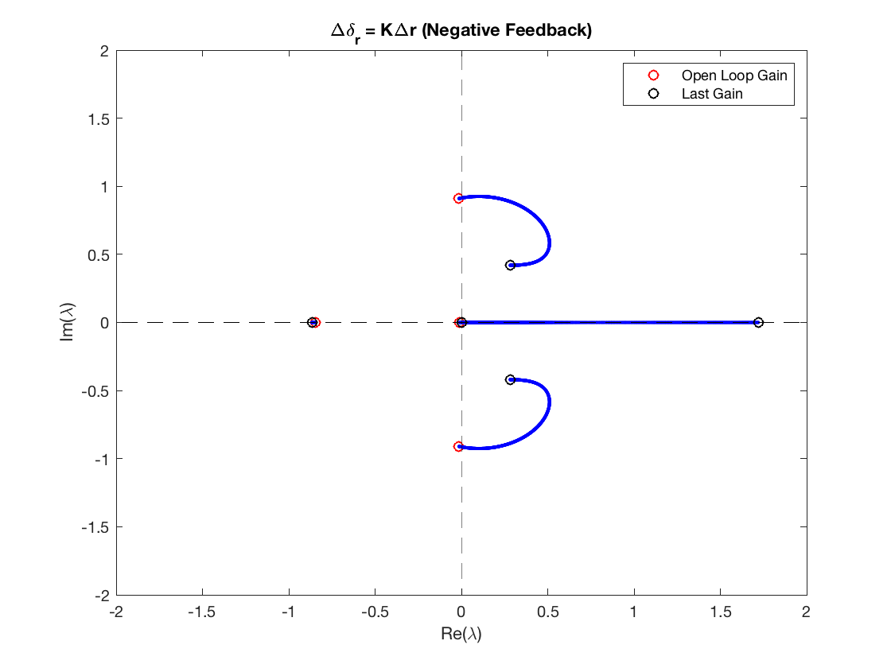  | 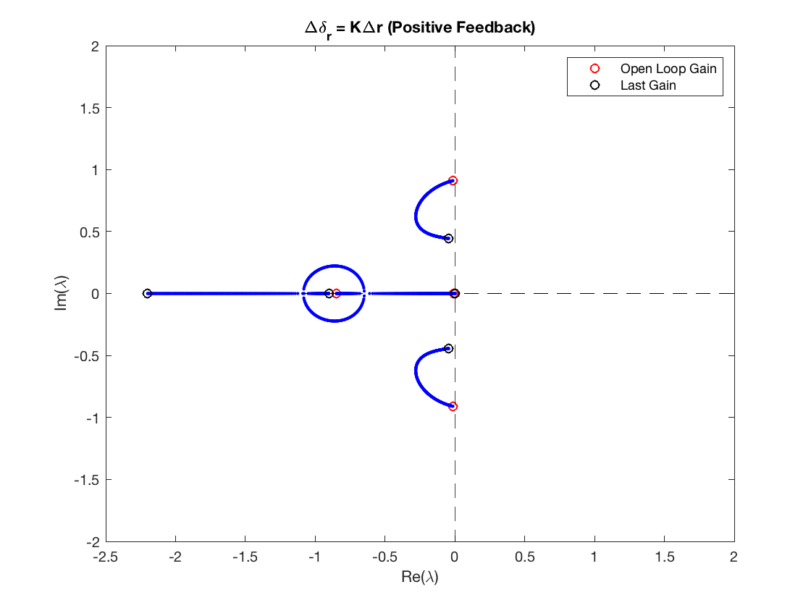  |
|:-------------------------------------------------:|:-------------------------------------------------:|
| Negative Gains                                    | Positive Gains                                    |
 

The negative and positive gains were plotted separately for an easier individual analysis. The negative gains were seen to make the dutch roll mode very unstable as the real parts became positive, showing an exponential increase in the perturbation. The roll mode remained basically unaffected, but the spiral mode also become increasingly less stable as the real parts became positive. The positive gains, in contrast to the negative gains, showed increasing stability for the dutch roll and spiral mode. These are the two modes that need to gain stability the most, which makes this a promising gain. The roll mode is seen to the get less stable, but starts off very stable, therefore, the middle of this K matrix hold very useful gains. Since the control matrix would be changing the entire $r$ column, the stability derivatives that would be effected would be the $Y_r$, $L_r$, and $N_r$. 

### **Part h.) - $\Delta\delta_a = 0$, $\Delta\delta_r = K\Delta\phi$, $|K| = 0:0.01:5$**

| 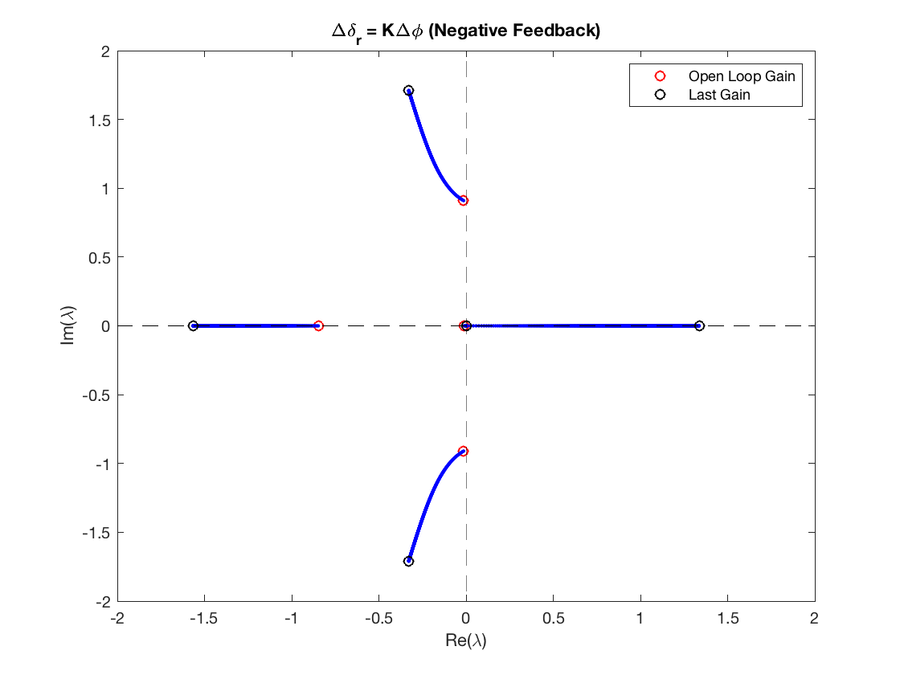  | 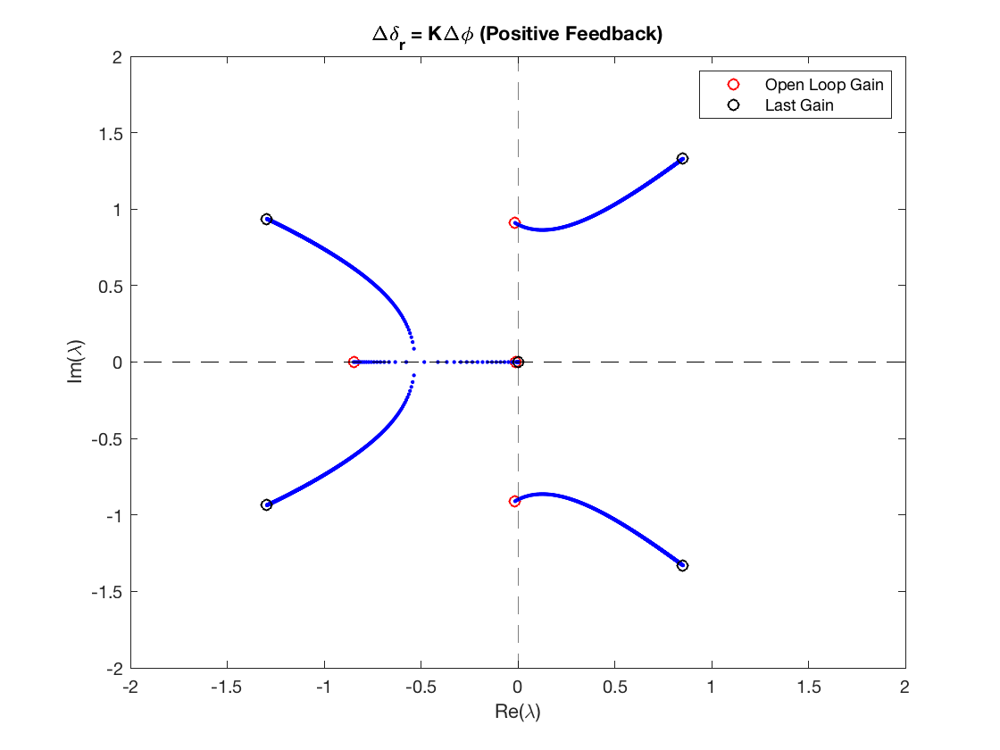  |
|:-------------------------------------------------:|:-------------------------------------------------:|
| Negative Gains                                    | Positive Gains                                    |
 

Once again, the negative and positive gains were plotted separately for easier analysis. The positive gains are seen to make the dutch roll mode very unstable. The roll mode initially gets less stable but then splits to become a conjugate pair with the spiral mode, where it's real parts become increasingly more negative. The spiral mode gets more and more negative the entire time, which means it is getting more and more stable. The negative gains switch rolls, where the spiral mode and roll mode become less stable, but the real parts of the dutch roll mode become more negative. The dutch roll mode's imaginary parts grow faster than the real parts decrease, therefore, would mostly likely become less stable as well. Since the control matrix would be changing the entire $\phi$ column, no stability derivatives would be directly effected int the A matrix.  

## **Part i.) - $\Delta\delta_a = 0$, $\Delta\delta_r = K\Delta\psi$, $|K| = 0:0.01:5$**

| 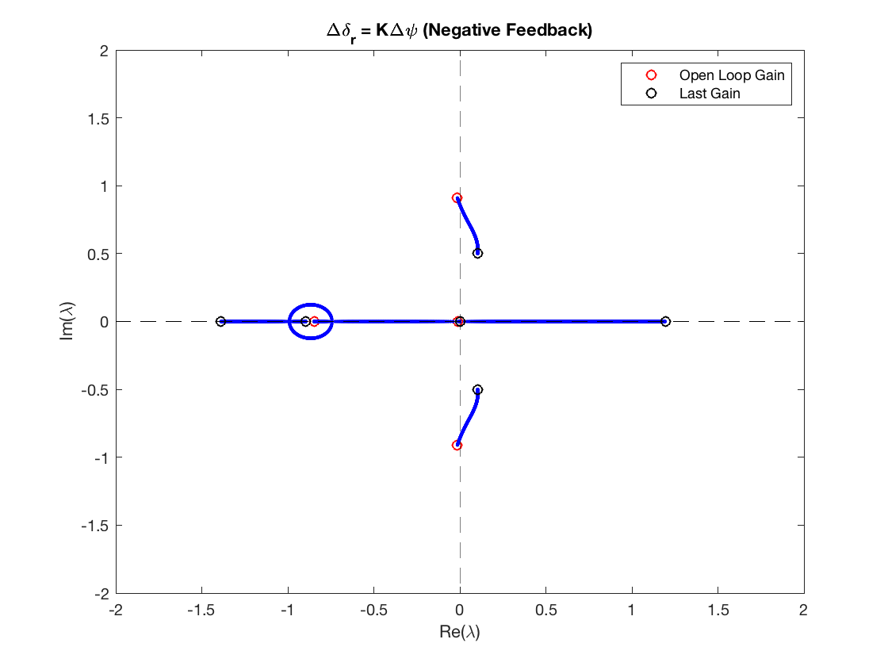  | 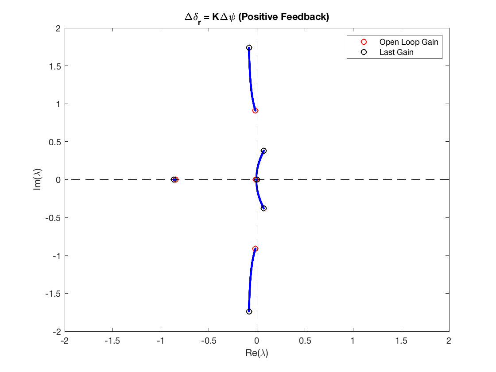  |
|:-------------------------------------------------:|:-------------------------------------------------:|
| Negative Gains                                    | Positive Gains                                    |
 

Lastly, the negative and positive gains are split up again for easy of analysis. The negative gains are seen to make the dutch roll mode less stable as the real parts become increasingly positive. The roll and spiral mode split into conjugate pairs before tracing away. The positive gains also show decreasing stability for the ditch roll mode as the imaginary parts grow much faster than the real parts decrease. The roll mode remains near constant ans the spiral mode acquires imaginary parts and positive real parts making it very unstable. Since the control matrix would be changing the entire $\psi$ column, no stability derivatives would be directly effected in the A matrix.  

## Question 5 - Closed Loop Response:

Implementing the results from question 4 to design a feedback control law using aileron and rudder feedback, using a single variable from the state matrix to drive each control surface for the following design specifications from an initial condition of $y_{aug} = [10, -0.14. 0.05, 0, 0, 0]^T$ ( SI units ): 

<ins>Design Requirements:</ins>  

$\Delta v \le 6$ [m/s] 

$\Delta\psi \le 5$ [deg]  

$\tau_{Dutch\,\,Roll} \le 40$ [sec]  

$\zeta_{Dutch\,\,Roll} \ge 0.35$  

$\tau_{Spiral\,\,Mode} \le 25$ [sec] 

$\Delta \delta_a \le 10$ [deg] 

$\Delta \delta_r \le 10$ [deg]   

As can be seen by the design requirements, it was necessary worry about controlling the two least stable modes, the dutch roll mode and the spiral mode. When applying the restrictions on the dutch roll mode and the spiral mode, it was noticed that the dutch roll mode's target area  was bounded by a region while the spiral mode was bounded by a line. Initially the gains $K_{rr}$ and $K_{a\phi}$ were chosen based on insights from problem 4, where $K_{rr}$ helped control the dutch roll mode and $K_{a\phi}$ helped control the spiral mode. After running through a loop and plotting it against the target region, it was noticed that only the gain $K_{rr}$ was needed to satisfy the design requirements. A plot of a range of $K_{rr}$ values and the target region is provided below:  

**Best Gain:**  

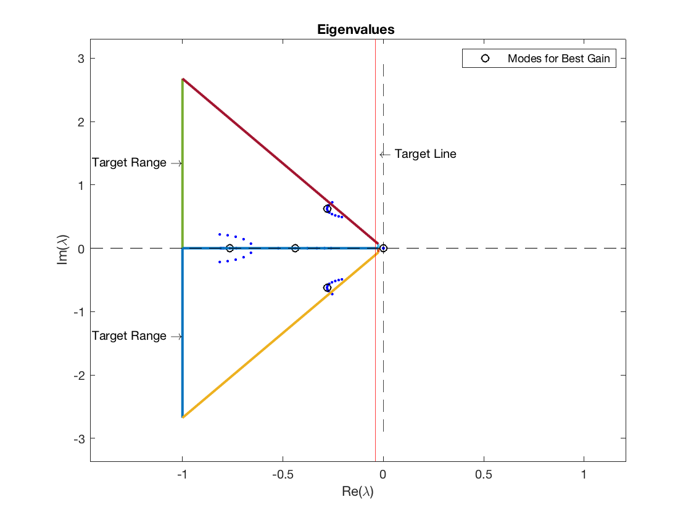 

As can be seen by the plot, the best gain of $K_{rr}$ was taken as the largest negative real part of the dutch roll mode for the range of values that were in the target region. This corresponds to a gain of $K_{rr}$ = 1.9. The spiral mode is the mode on the real line at a value of about -0.45, which can be seen is much greater than the design line plotted in red. The corresponding design variables are numerically given or plotted below:  

**State Variable Repsonse:**  

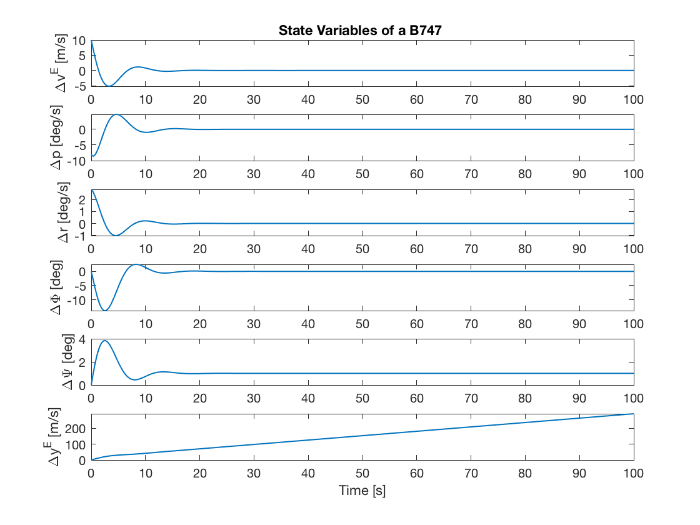 

**Control Surface Repsonse:**  

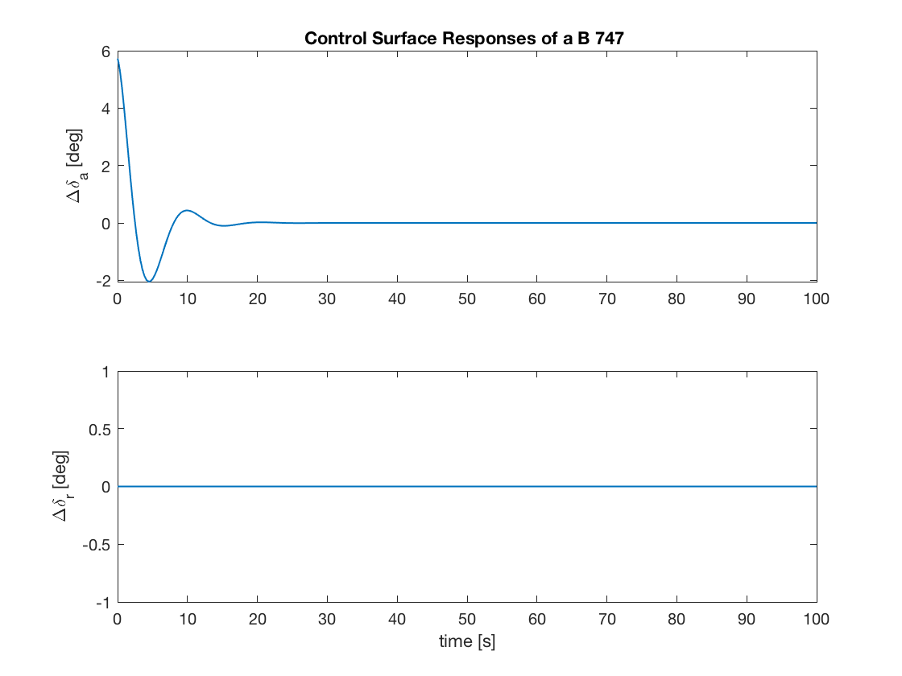 

<ins>Results:</ins>  

$\tau_{Dutch\,\,Roll} = 3.57$ [sec]  

$\zeta_{Dutch\,\,Roll} = 0.41$  

$\tau_{Spiral\,\,Mode} = 2.28$ [sec]    

As can be seen visually, all the design requirements were satisfied as $\Delta v \le 6$ [m/s], $\Delta\psi \le 5$ [deg], $\Delta\delta_a \le 10$ [deg], and
$\Delta \delta_r \le 10$ [deg]. Since this design only implemented a gain that proportionally changes $\Delta r$, the only stability derivatives that were effected in the A matrix were $Y_r$, $L_r$, and $N_r$.